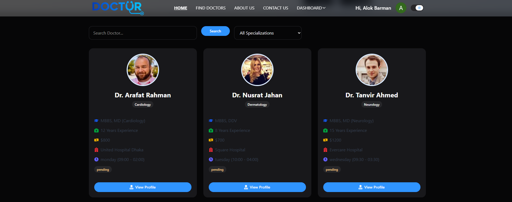
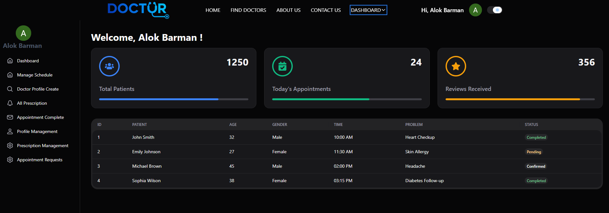

# 🏥 Doctor Appointment Management System

A modern and responsive **Doctor Appointment Management System** built with **Next.js 15**, **React**, **Tailwind CSS**, and **HeroUI**. This platform allows patients to search doctors, view profiles, book appointments, and manage healthcare services efficiently.

---

## 📸 Screenshot

### Home Page

### Dashboard

### Doctor list

---

# ✨ Features

### 👨‍⚕️ Patient Features

* 🔍 Search doctors by name
* 🩺 Filter doctors by specialization
* 👀 View detailed doctor profile
* 📅 Book appointments
* 💳 Secure appointment confirmation
* 📱 Fully Responsive Design

---

### 👨‍⚕️ Doctor Features

* View appointment requests
* Accept appointments
* Reject appointments
* Manage profile

---

### 🔐 Authentication

* User Registration
* Login
* Protected Routes
* JWT Authentication
* Role Based Access

---

### 🎨 UI Features

* Beautiful Hero Section
* Loading Spinner
* Toast Notifications
* Responsive Navbar
* Modern Cards
* Search & Filter
* Modal Components
* Clean Dashboard

---

# 🛠 Tech Stack

## Frontend

* Next.js 
* React 
* Tailwind CSS
* HeroUI
* React Icons

## Backend

* Node.js
* Express.js
* MongoDB

## Authentication

* Better Auth
* JWT

## Deployment

* Vercel

---

# 🌐 Pages

* Home
* About
* Find Doctors
* Doctor Details
* Appointment
* Dashboard
* Login
* Register

---

# 📱 Responsive Design

✔ Desktop

✔ Tablet

✔ Mobile

---

# 👨‍💻 Author

**Alok Barman**

Frontend Developer

---